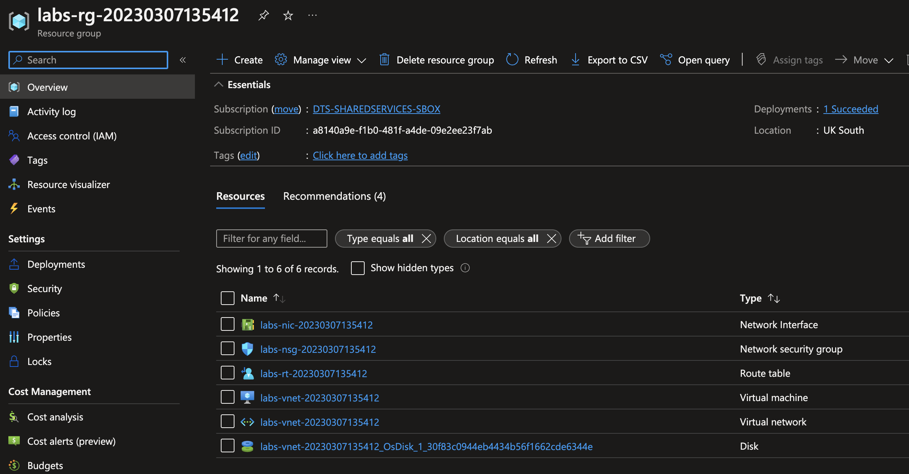
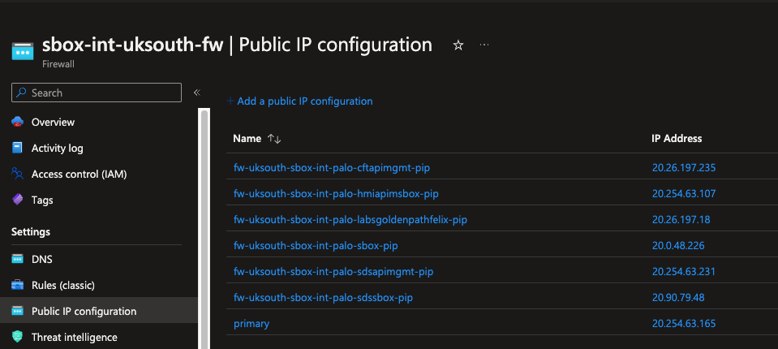
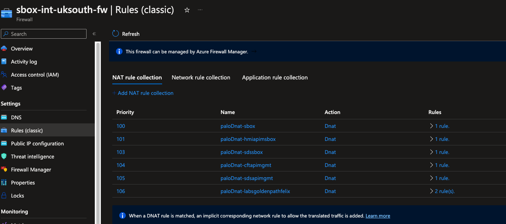
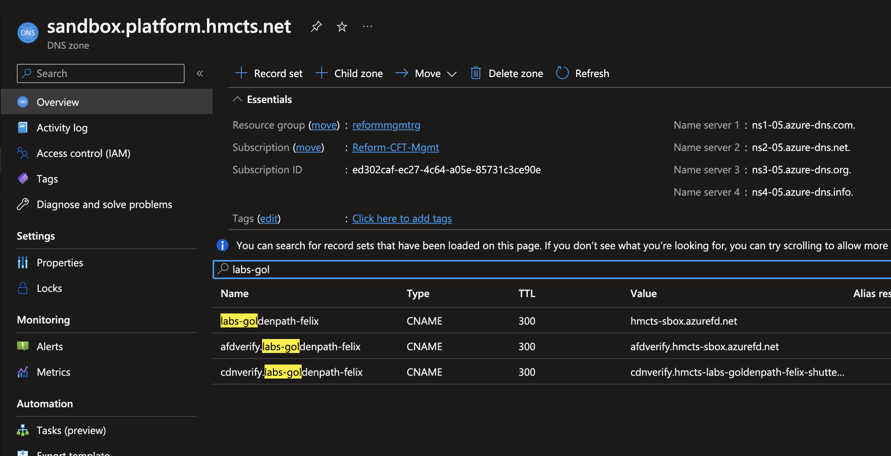
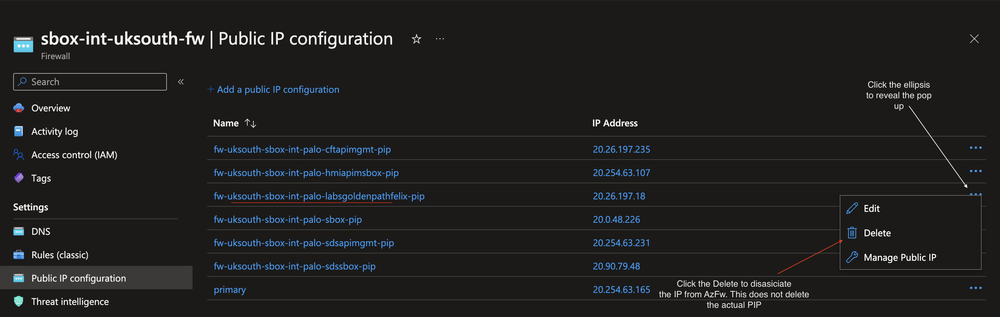

# GoldenPath HandsOn

## Section 1 - Virtual Networks

Checkout [goldenpath-platops](link) repo, cd into the labs-azure-resource folder

### Step 1
Run the following commands to confirm you are in the right repository
```cmd 
az login
```

```cmd
az account show
``` 
```cmd
az account set --subscription DTS-SHAREDSERVICES-SBOX
```

```cmd
az account show
```

### Step 2

Run the following command terraform commands
```cmd 
terraform init
```
```cmd 
terraform plan
```
```cmd 
terraform apply
```

Select `yes` to build resource as terraform will prompt you to approve you action

Log into the Azure portal and navigate to the `DTS-SHAREDSERVICES-SBOX` subscription, you should now have similar resources created

<details>

<summary>Terraform resources</summary>



</details>

📣 Verify the following
- A Vnet exits
- VNet has two peerings, one to the Hub and the other to the core management vnet
- A route table to one default route to x.x.x.x

Select the virtual network and copy the vnet address cidr e.g. `10.10.7.0/25`

### Step 3. 

Checkout the [hub-panorama-terraform](https://github.com/hmcts/hub-panorama-terraform) repo and create a new branch 

Navigate to [02-addresses-sbox.tf](https://github.com/hmcts/hub-panorama-terraform/blob/master/components/configuration/groups/objects/address-objects/02-addresses-sbox.tf) file add a new address object called `labs-goldenpath-<yourname>`, for example

```json
 {
   environments = ["sbox"]
   device_group = "sbox"
   name         = "labs-goldenpath-<yourname>"
   value        = "10.10.7.0/25"
}
```
The value should be the cidr address space for your vnet
 
Next navigate to the `/components/configuration/groups/policies/secuity-policy-rules/04-policy-rules-sbox/tf` file and
  create a new security policy with the following details
```json
{
  environments          = ["sbox"]
  device_group          = "sbox"
  name                  = "labs-goldenpath-<yourname>"
  source_zones          = [var.zone_untrusted]
  destination_zones     = [var.zone_trusted]
  source_addresses      = ["any"]
  destination_addresses = ["labs-goldenpath-<yourname>"]
  services              = ["service-http"]
  action                = "allow"
  disabled              = false
}
```

Ordering of security rules does matter, but you can add this just after the "trusted-default" policy. This is telling the firewall
  to allow traffic coming from the untrusted zone, internet traffic, to your vnet in the trusted zone

### Step 4  

Add your new address object to the `G_Trusted` group. What this does is to allow your vnet communicate with other vnet. e.g. when logged in via the VPN you can ssh via the bastions to your vm
   
To do this navigate to the Address Group folder to `/components/configuration/groups/objects/address-gropus/02-address-groups-sbox.tf` add the your new address object to the existing `G_truted` group's `static_addresses` list. 

Example below
```json
 {
   environments = ["sbox"]
   device_group = "sbox"
   name         = "G_trusted"
   static_addresses = [
   ...,
   "labs-goldenpath-<yourname>"
   ]
}
```  

### Step 5
Commit your changes, add relevant details to your PR, review plan and merge 

### Step 6
Log into the [sbox Panorama management](https://panorama-sbox-uks-0.sandbox.platform.hmcts.net) ui and review your changes are in place. 
Note, you need to be on the VPN to access this resource. To find out how to access the VPN if not already done so, please have a
read of this [document](link).

You should now have resources similar to the following:

<details>

<summary>Address Object entry</summary>


</details>

<details>

<summary>Address Group entry</summary>


</details>

<details>

<summary>Security policy entry</summary>


</details>


### Step 7
Create an an Azure Firewall DNAT rule (explain why dnat). Checkout the [rdo-terraform-hub-dmz](https://github.com/hmcts/rdo-terraform-hub-dmz) repo

To add a new DNAT rule, navigate to the xxx and add the following snipet, name should be the name of you lab and ip that of your apache server
Use the next available index in your case, you can find this resource in [sbox-int-uksouth-fw](https://portal.azure.com/#@HMCTS.NET/resource/subscriptions/ea3a8c1e-af9d-4108-bc86-a7e2d267f49c/resourceGroups/hmcts-hub-sbox-int/providers/Microsoft.Network/azureFirewalls/sbox-int-uksouth-fw/rules)
```json
{
   name : "labsgoldenpath<yourname>",
   palo_ips : {
   "uksouth" : "10.10.7.4",
   "ukwest" : "10.10.7.4"
   },
   port : [80,]
   index : 6
}
``` 

📣**Note:** Adding the `ukwest` option is not necessary in this instance as the resource of built in `uksouth` only.

Commit your PR, review your plan and merge.

Go to the Azure portal and review your changes in the [sbox-int-uksouth-fw](https://portal.azure.com/#@HMCTS.NET/resource/subscriptions/ea3a8c1e-af9d-4108-bc86-a7e2d267f49c/resourceGroups/hmcts-hub-sbox-int/providers/Microsoft.Network/azureFirewalls/sbox-int-uksouth-fw/overview)
This will create a new public Ip address, you can verify your new IP by looking at the IP configuration in the `IP Configuration` menu right of
the firewall menu you should see something similar to `fw-uksouth-sbox-int-palo-labsgoldenpathfelix-pip`. 

Resources would be similar to the following:

<details>

<summary>IP Configuration</summary>



</details>

<details>

<summary>Azure Firewall rules</summary>



</details>

📣 Keep a note of the public IP address

At this point you should be abble to access your apache server from your browser using the default
DNS record created which is associated with the Azure Firewall. The DNS record should
be similar to `http://firewall-sbox-int-palo-labsgoldenpathfelix.uksouth.cloudapp.azure.com/` depending on your lab name.


### Step 8
Create a Public DNS record. 

Checkout the [azure-public-dns](https://github.com/hmcts/azure-public-dns)

Navigate to [sandbox.yml](https://github.com/hmcts/azure-public-dns/blob/master/environments/sandbox.yml) file add a new CNAME record using Azure Frontdoor url `hmcts-sbox.azurefd.net` 
```yaml
cname:
...
- name: "afdverify.labs-goldenpath-felix"
  ttl: 300
  record: "afdverify.hmcts-sbox.azurefd.net"
- name: "labs-goldenpath-felix"
  ttl: 300
  record: "hmcts-sbox.azurefd.net"
  shutter: false
- name: "cdnverify.labs-goldenpath-felix"
  ttl: 300
  record: "cdnverify.hmcts-labs-goldenpath-felix-shutter-sbox.azureedge.net"
```

📣 **NOTE:** You will need to add all 3 entries to enable Azure frontdoor verify your DNS record.

You should now see the similar entries as below

<details>

<summary>Public DNS entries</summary>



</details>

### Step 9 
Create a corresponding Frontdoor entries.

Checkout the [azure-platform-terraform](https://github.com/hmcts/azure-platform-terraform) repo

Navigate to the [sbox.tfvar](https://github.com/hmcts/azure-platform-terraform/blob/master/environments/sbox/sbox.tfvars) file and add the below entry to the `frontends` property list

```json
{
  product          = "labs-goldenpath-<yourname>"
  name             = "labs-goldenpath-<yourname>"
  custom_domain    = "labs-goldenpath-<yourname>.sandbox.platform.hmcts.net"
  backend_domain   = ["firewall-sbox-int-palo-labsgoldenpath<yourname>.uksouth.cloudapp.azure.com"]
  certificate_name = "wildcard-sandbox-platform-hmcts-net"
  disabled_rules   = {}
}
```

### Step 10
Verify that you can
- Navigate to your url e.g. `https://labs-goldenpath-<yourname>.sandbox.platform.hmcts.net` see your web ser er page
  
  <details>

  <summary>Final result</summary>
  
  
  
  </details>
  
- Navigate to the [Panorama management UI](https://panorama-sbox-uks-0.sandbox.platform.hmcts.net) and see your traffic logs.

  To filter the logs you can type in the belo query in the search bar
  ```cmd
  ( addr.dst in <your-vm-private-ip> )
  ```
  Where `<your-vm-private-ip>` is the same as the IP on your virtual machine

    <details>

    <summary>Final result - logs</summary>
  
    
  
    </details>

## Section 2 - AKS Cluster
There is a [Backstage GoldenPath documentation](https://backstage.platform.hmcts.net/docs?filters%5Buser%5D=all) for the AKS cluster which would walk you through the steps required in creating
applications in the AKS cluster. 

📣 **NOTE:** You need to be on  the VPN to access the documentation

## Section 3 - Clean Up

After completing the above steps you should tear down all the resources created. This 
saves the business money and helps prevent floating resources.

To roll back, do the following
- You need to disassociate the pip Azure Firewall created from the firewall

  <details>
  
  <summary>AzFw disassociate pip</summary>
  
  
  
  </details>
- If you ran the [labs-azure-resource](/lab-azure-resource) from your local machine, you have a local statefile. Execute the command below to tear the resources in your resource group
  ```cmd
  terraform destroy
  ```
- For all the other PR's created, create new one removing only the bit you added following above steps, commit, review plan then merged.
- Verify that all the resources no longer exist

## Section 4 - Further Steps
Now that you have come to the end of this exercise, there is still alot more to learn.

You ,may have notice that you built your terraform resources from you loacal machine. This is far from how things
are done in live environments. As a next step you could
- Create a new Git repo using the code base as a start
- Update the configuration so that it does not try to `destroy` and re-create everything with every `terraform plan`. the key is in the `local.prefix` variable
- Create a new Azure DevOps project under the [Platform Operations](https://dev.azure.com/hmcts/PlatformOperations) organisation
  You can follow these recommended [blogs](link) for more information
- Link your Git repo to Azure so that subsequent commits trigger a build
- Set up backend state file for your project

