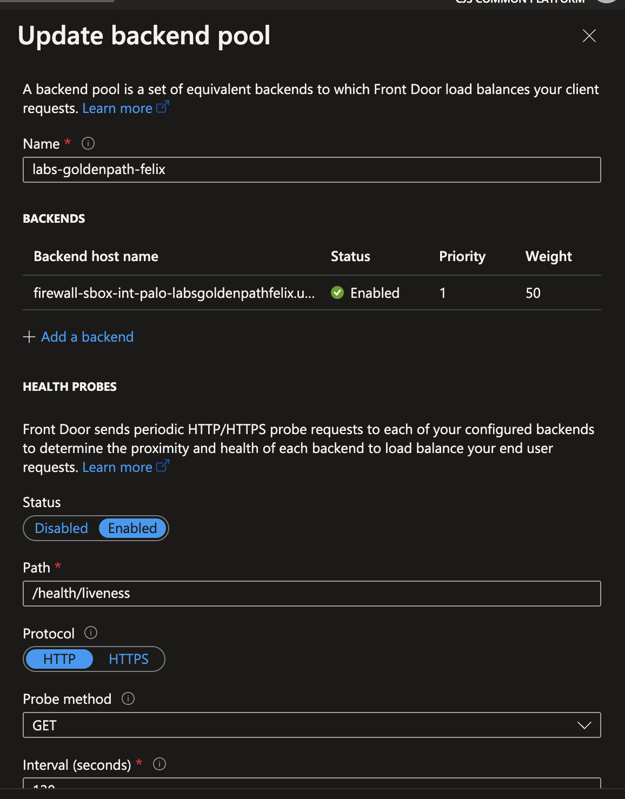
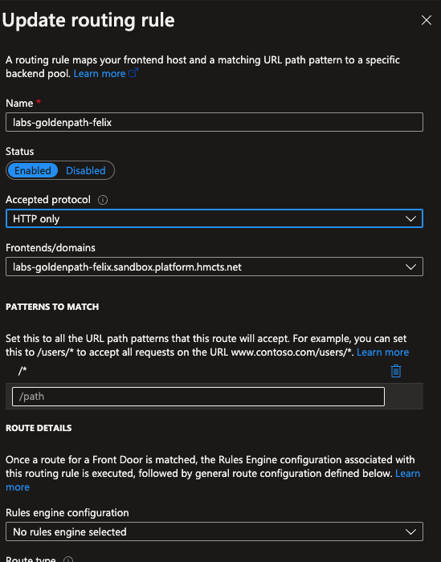

# GoldenPath HandsOn

## Section 1 - Virtual Networks

Checkout [goldenpath-platops](link) repo, change directory into the `labs-azure-resource` folder and follow the below steps in order 🙂

### Step 1
Run the following commands to confirm you are in the right repository
```cmd 
az login
```

```cmd
az account show
``` 
```cmd
az account set --subscription DTS-SHAREDSERVICES-SBOX
```

```cmd
az account show
```

### Step 2

Run the following command terraform commands
```cmd 
terraform init
```
```cmd 
terraform plan
```
```cmd 
terraform apply
```

Select `yes` to build resource as terraform will prompt you to approve you action

Log into the Azure portal and navigate to the `DTS-SHAREDSERVICES-SBOX` subscription, you should now have a similar resources created

<details>

<summary>Terraform resources</summary>


</details>

📣 Verify the following
- A Vnet exist
- VNet has two peerings, one to the Hub and the other to the Core Management Vnet
- A route table to one default route to x.x.x.x

#### What did i just create?
- A virtual network thats peered to 2 other vnets using the [vnet peering module](https://github.com/hmcts/terraform-module-vnet-peering)
  VNet peering is essential for cummunication between the various virtual networks
  Most importantly, for network traffic to flow from the [Hub](https://tools.hmcts.net/confluence/pages/viewpage.action?pageId=1511141283&__ncforminfo=ymJBSB3MQGJBph2cKEBJyqCsBFWvxnc2MHXLdaHv9ij45Z6HI42LhSPf1gMsfkZf5Z9pFf8NqzFbb6eCiIdJLJ3k6a0QAqQD) vnet where the firewall lives to your vnet they need to be peered
- [Tagged](https://tools.hmcts.net/confluence/display/DTSPO/Tagging+v1) resources using the [tagging module](https://github.com/hmcts/terraform-module-common-tags). Tagging is an important part of they way we manage resources and is essential for managing running infrastructure and costing.
- A custom route table that routes all traffic to the hub. We operate a [hub and spoke](https://tools.hmcts.net/confluence/pages/viewpage.action?pageId=1511141283&__ncforminfo=ymJBSB3MQGJBph2cKEBJyqCsBFWvxnc2MHXLdaHv9ij45Z6HI42LhSPf1gMsfkZf5Z9pFf8NqzFbb6eCiIdJLJ3k6a0QAqQD) model. All network traffic should pass thriugh the hub for inspection before beign forwared to its destination. In our hub we have
  2 active Palo Alto firewall NVA that inspects traffic and forwards it if allowed to the next hop.
- A virtual machine without a public IP. We normally dont allow direct access from the intrent to the backend resources. This has to con via another route which passes the hub and firewalls. This patter yu
  will see in most if not all resources or applications
- A virtual machine that can be [accessed](https://tools.hmcts.net/confluence/display/DTSPO/Access+HMCTS+Bastions) via the bastions, as it does not have a public IP, because its been peered with the core-infra-mgmt vnet can access it via the HMCTS [bastions](https://portal.azure.com/#@HMCTS.NET/resource/subscriptions/b3394340-6c9f-44ca-aa3e-9ff38bd1f9ac/resourceGroups/bastion-sbox-rg/overview). You will need
  [VPN access](https://tools.hmcts.net/confluence/pages/viewpage.action?pageId=1473556716&__ncforminfo=KrJ3_ABh6jWfksWuXyV3P0AVgDdrdldO1RMJDzjYyO2Y_8le-aWjrz_SqURx_CEKdqcwKxg6d_xZAN5A1vZizn230itnkRum) for this

Select the virtual network and copy the vnet address cidr e.g. `10.10.7.0/25` yours would be different if you used a different CIDR

### Step 3.

Checkout the [hub-panorama-terraform](https://github.com/hmcts/hub-panorama-terraform) repo and create a new branch

Navigate to [02-addresses-sbox.tf](https://github.com/hmcts/hub-panorama-terraform/blob/master/components/configuration/groups/objects/address-objects/02-addresses-sbox.tf) file and add a new address object called `labs-goldenpath-<yourname>` (example below)

```json
 {
   environments = ["sbox"]
   device_group = "sbox"
   name         = "labs-goldenpath-<yourname>"
   value        = "10.10.7.0/25"
}
```

The value should be the cidr address space of your vnet

Next navigate to the [sandbox policy rules](https://github.com/hmcts/hub-panorama-terraform/blob/master/components/configuration/groups/policies/security-policy-rules/02-security-profiles.tf) file and
create a new security policy with the following details

```json
  {
    environments          = ["sbox"]
    device_group          = "sbox"
    name                  = "labs-goldenpath-<yourname>"
    source_zones          = [var.zone_untrusted]
    destination_zones     = [var.zone_trusted]
    source_addresses      = ["any"]
    destination_addresses = ["labs-goldenpath-<yourname>"]
    applications          = ["web-browsing"]
    services              = ["application-default"]
    action                = "allow"
    disabled              = false
}
```


The ordering of security rules doesn't matter, however we recommend you add this just after the "trusted-default" policy. This is telling the firewall
  to allow traffic coming from the untrusted zone, internet traffic and to your Vnet in the trusted zone

### Step 4

Add your new address object to the `G_Trusted` group and this allows your Vnet to communicate with other Vnets. For example, when you're logged in via the VPN you can ssh via the bastions to your virtual machine
   
To do this navigate to the Address Group folder to `/components/configuration/groups/objects/address-gropus/02-address-groups-sbox.tf` . Add your new address object to the existing `G_truted` group's `static_addresses` list e.g. labs-goldenpath-yourname (not the full code block). 

Example below
```json
 {
   environments = ["sbox"]
   device_group = "sbox"
   name         = "G_trusted"
   static_addresses = [
   ...,
   "labs-goldenpath-<yourname>"
   ]
}
```  

### Step 5
Commit your changes; add the relevant details to your PR, review the plan and merge (once approved). 

### Step 6
Log into the [Sbox Panorama Management](https://panorama-sbox-uks-0.sandbox.platform.hmcts.net) UI and review your changes are in place. 
Please note, you need to be on the VPN to access this resource. To find out how to access the VPN read the following [document](link).

🛠️ Commit your changes, add the relevant details to your PR and review plan & merge

#### What did i just create?
From the above entries you have created a security policy that allows network request flow through the firewall to yourvirtual machince
in your vnet. Without this rule your applications or services would be unreachable as they are not accessible from the internet by default


You should now have resources similar to the following:

<details>

<summary>Address Object Entry</summary>


</details>

<details>

<summary>Address Group Entry</summary>


</details>

<details>

<summary>Security Policy Entry</summary>


</details>


### Step 7
Create an Azure Firewall [DNAT](https://learn.microsoft.com/en-us/azure/firewall/tutorial-firewall-dnat) rule and checkout the [rdo-terraform-hub-dmz](https://github.com/hmcts/rdo-terraform-hub-dmz) repo

To add a new DNAT rule, navigate to the file [path](https://github.com/hmcts/rdo-terraform-hub-dmz/blob/master/env_tfvars/hub-sbox-int.tfvars) and add the following snippet. The name of this should be same name of your lab and IP of your apache server (in the virtual machine created in step 2).

Use the next available index in your case, you can find this resource in [sbox-int-uksouth-fw](https://portal.azure.com/#@HMCTS.NET/resource/subscriptions/ea3a8c1e-af9d-4108-bc86-a7e2d267f49c/resourceGroups/hmcts-hub-sbox-int/providers/Microsoft.Network/azureFirewalls/sbox-int-uksouth-fw/rules)
```json
{
   name : "labsgoldenpath<yourname>",
   palo_ips : {
   "uksouth" : "10.10.7.4",
   "ukwest" : "10.10.7.4"
   },
   port : [80,]
   index : 6
}
``` 

🛠️ Create a new branch, commit, review and merge your PR

Go to the Azure portal and review your changes in the [sbox-int-uksouth-fw](https://portal.azure.com/#@HMCTS.NET/resource/subscriptions/ea3a8c1e-af9d-4108-bc86-a7e2d267f49c/resourceGroups/hmcts-hub-sbox-int/providers/Microsoft.Network/azureFirewalls/sbox-int-uksouth-fw/overview),
this will create a new public IP address. You can verify your new IP by looking at the IP configuration (in the `IP Configuration` menu). On the right of
the firewall menu, you should see something similar to `fw-uksouth-sbox-int-palo-labsgoldenpathfelix-pip`. 

Resources would be similar to the following:

<details>

<summary>IP Configuration</summary>


</details>

<details>

<summary>Azure Firewall rules</summary>


</details>

📣 Keep a note of the public IP address

At this point you should be able to access your apache server from your browser by using the default
DNS record created, which is associated with the Azure Firewall. The DNS record should
be similar to `http://firewall-sbox-int-palo-labsgoldenpathfelix.uksouth.cloudapp.azure.com/` depending on your lab name.

### Step 8

Create a Public DNS record.

Checkout the [azure-public-dns](https://github.com/hmcts/azure-public-dns)

Navigate to [sandbox.yml](https://github.com/hmcts/azure-public-dns/blob/master/environments/sandbox.yml) file add a new CNAME record using Azure Frontdoor url `hmcts-sbox.azurefd.net`
```yaml
cname:
...
- name: "afdverify.labs-goldenpath-felix"
  ttl: 300
  record: "afdverify.hmcts-sbox.azurefd.net"
- name: "labs-goldenpath-felix"
  ttl: 300
  record: "hmcts-sbox.azurefd.net"
  shutter: false
- name: "cdnverify.labs-goldenpath-felix"
  ttl: 300
  record: "cdnverify.hmcts-labs-goldenpath-felix-shutter-sbox.azureedge.net"
```

🛠️ Create a new branch, commit, review and merge your PR

📣 **NOTE:** You will need to add all 3 entries to enable Azure Front Door verify your DNS record.

You should now see the similar entries as below

<details>

<summary>Public DNS entries</summary>


</details>


### Step 9
Create a corresponding Frontdoor entries.

Checkout the [azure-platform-terraform](https://github.com/hmcts/azure-platform-terraform) repo

Navigate to the [sbox.tfvar](https://github.com/hmcts/azure-platform-terraform/blob/master/environments/sbox/sbox.tfvars) file and add the below entry to the `frontends` property list

```json
{
  product          = "labs-goldenpath-<yourname>"
  name             = "labs-goldenpath-<yourname>"
  custom_domain    = "labs-goldenpath-<yourname>.sandbox.platform.hmcts.net"
  backend_domain   = ["firewall-sbox-int-palo-labsgoldenpath<yourname>.uksouth.cloudapp.azure.com"]
  certificate_name = "wildcard-sandbox-platform-hmcts-net"
  disabled_rules   = {}
}
```

🛠️  Create a new branch, commit, review and merge your PR. This PR takes a few minutes to complete, you can go grab a cup of coffee or tea

#### What did i just create?
A custom domain that matches to your DNS entry created above, a backend pool that frondoor sends request to which matches
the public ip created above and attached to the Azure firewall and a routing rule that Azure frontdoor needs to process
your requests.

  <details>

  <summary>Custom Domain</summary>

  

  </details>

  <details>

  <summary>Backend pool</summary>

  

  </details>

  <details>

  <summary>Routing rule</summary>

  

  </details>

### Step 10
Verify that you can
- Navigate to your url e.g. `https://labs-goldenpath-<yourname>.sandbox.platform.hmcts.net` and see your web server default page

  <details>

  <summary>Final result</summary>

  

  </details>

- Navigate to the [Panorama management UI](https://panorama-sbox-uks-0.sandbox.platform.hmcts.net) and see your traffic logs.

  To filter the logs you can type in the belo query in the search bar
  ```cmd
  ( addr.dst in <your-vm-private-ip> )
  ```

  Where `<your-vm-private-ip>` is the same as the IP on your virtual machine

    <details>

    <summary>Final result - logs</summary>

    

    </details>

- `ssh` onto you virtual machine by logging into the VPN and connecting to the sandbox bastion by running the command below
  ```cmd
  az ssh vm -n bastion-sbox -g bastion-sbox-rg --subscription DTS-MANAGEMENT-SBOX-INTSVC
  ```
  Once one the bastion `ssh` onto the VM using the below command
  ```cmd
  ssh labsAdmin2023@<your-vm-private-ip>
  ```
  Accept the fingerprint prompt and provide the VM password

## Section 2 - AKS Cluster
There is a [Backstage GoldenPath documentation](https://backstage.platform.hmcts.net/docs?filters%5Buser%5D=all) for the AKS cluster which would walk you through the steps required in creating
applications in the AKS cluster.

Follow the steps outlined in there and this would build your application in the AKS cluster and also the DNS and Frontdoor
entries as described above.

### Points to note when going through the AKS steps
- Make sure using <labs-YourGitHubUsername-nodejs> when configuring both Public DNS/Private DNS for Application
- There maybe needed some troubleshooting e,g version deprecated/update. 

📣 **NOTE:** You need to be on the [VPN](https://tools.hmcts.net/confluence/pages/viewpage.action?pageId=1473556716&__ncforminfo=KrJ3_ABh6jWfksWuXyV3P0AVgDdrdldO1RMJDzjYyO2Y_8le-aWjrz_SqURx_CEKdqcwKxg6d_xZAN5A1vZizn230itnkRum) to access the documentation

## Section 3 - Clean Up

After completing the above steps you should tear down all the resources created. This
saves the business money and helps prevent floating resources.

To roll back, do the following
- You need to disassociate the PIP Azure Firewall created from the firewall

  <details>

  <summary>AzFw disassociate pip</summary>

  

  </details>
- If you ran the [labs-azure-resource](/lab-azure-resource) from your local machine, you have a local statefile. Execute the command below to tear the resources in your resource group
  ```cmd
  terraform destroy
  ```
- For all the other PR's created, create a new one removing only the part you added following the above steps, commit, review plan and then merge.
- Verify that all the resources no longer exist

## Section 4 - Further Steps
Now that you have come to the end of this exercise, there is still alot more to learn.

You may have noticed that you built your terraform resources from you local machine. This is far from how things
are done in live environments.

As your next steps, you could
- Create a new Git repo using the code base as a start
- Update the configuration so that it does not try to `destroy` and re-create everything with every `terraform plan`. The key is the `local.prefix` variable
- Create a new Azure DevOps project under the [Platform Operations](https://dev.azure.com/hmcts/PlatformOperations) organisation.
  Check out this [blog](https://thomasthornton.cloud/) which has good content of Azure DevOps
  
- Link your Git repo to Azure so that subsequent commits trigger a build
- Set up backend state file for your project
- Create a 2 subnets with a `/26` mask and use one as the virtual machine subnet

